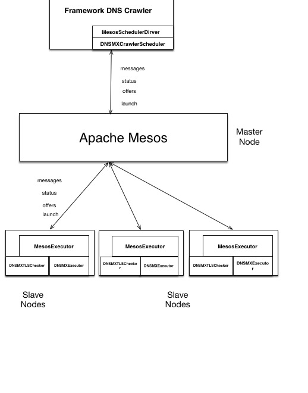

Mesos DNS TLS Crawler
=====================


## Problem
Suppose you have a large database of millions of domains, which grow on daily and weekly basis. Of all the domains registered, each has an MX record associated with it if they use a mail server or if mail is delivered for that particular domain. When I worked at VeriSign, which was a company that sold SSL certs for website and Secure mail, we wanted to ascertain which registered domain used TLS for their mail servers. 

Back when I wrote a C++ crawler that partitioned domains into batches of 10K domains, inserted each batch into a queue, and had a pool of threads go at it: each thread did two tasks: 1) check with the DNS to find its MX records and b) for each MX record establish a TLS handshake with the SMTP server to ascertain whether it uses a TLS secured hanshake, and update a field in the master domain DB.

Today, it would seem like a classic MapReduce Job. Create a bunch of Mappers for fetching the MX records and send the list to reducers to check TLS. Or even have the mappers do both fetch MX and check TLS. I could to this seamlesly with Apache Spark, and with some effort using MapReduce APIs. Even better I could quickly implement a  Mesos framework scheduler with executors that do the tasks for me.

As a first phase, I wrote a quick proof of concept to see how easy it would be to write a distributed application using Mesos Framework API. So the first phase is just a proof of concept. The second phase will attempt to emulate what I did at VeriSign. 

If I am ambitious, I might as well write a Python crawler as single unit of execution that reads buckets from distributed file system, such as HDFS, or distributed storage, such as S3, containerize it as a Docker application, and deploy it via Marathon, omitting the need to write a Mesos framework scheduler. 

But first let's have a go at the proof of concept as a Mesos Framework. It's a good excercise to learn, try, do and share.


DNS Crawler  consists of four main classes or components:

- `DNSMXExecutor` extends `mesos.Executor`
- `DNSMXTLSChecker` extends `mesos.Executor`
- `DNSMXCrawlerMain` the driver that connects to the Mesos Master`
- `DNSMXCrawlerSchedule

The diagram shows the interaction of these classes with Mesos master as the indireciton layer between the Scheduler and Executors.



## Quick Start with Vagrant

### Requirements

- [VirtualBox](http://www.virtualbox.org/) 4.1.18+
- [Vagrant](http://www.vagrantup.com/) 1.3+
- [git](http://git-scm.com/downloads) (command line tool)

### Start the `mesos-demo` VM

```bash
$ wget http://downloads.mesosphere.io/demo/mesos.box -O /tmp/mesos.box
$ vagrant box add --name mesos-demo /tmp/mesos.box
$ git clone https://github.com/dmatrix/examples/mesos-sampler.git
$ cd mesos-sampler
$ vagrant up
```

Now that the VM is running, you can view the Mesos Web UI here:
[http://10.141.141.10:5050](http://10.141.141.10:5050)

You can see that 1 slave is registered and you've got some idle CPUs and Memory. So let's start the Command Sampler!

### Run DNS Crawler Framework in the `mesos-demo` VM

Go to the java directory and follow the instructions in how to compile and launch the DNS Crawler.

### Shutting down the `mesos-demo` VM

```bash
# Exit out of the VM
vagrant@mesos:hostfiles $ exit
# Stop the VM
$ vagrant halt
# To delete all traces of the vagrant machine
$ vagrant destroy
```
